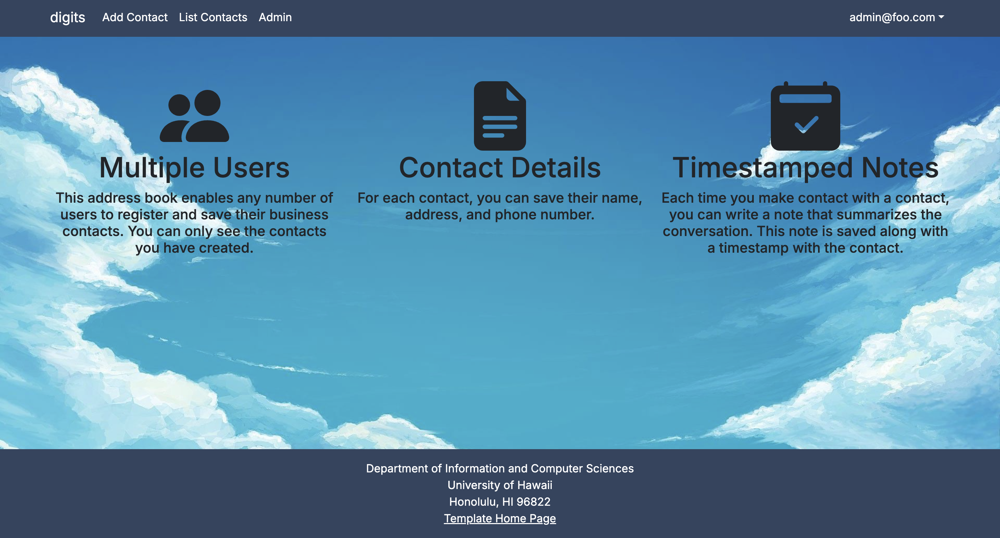
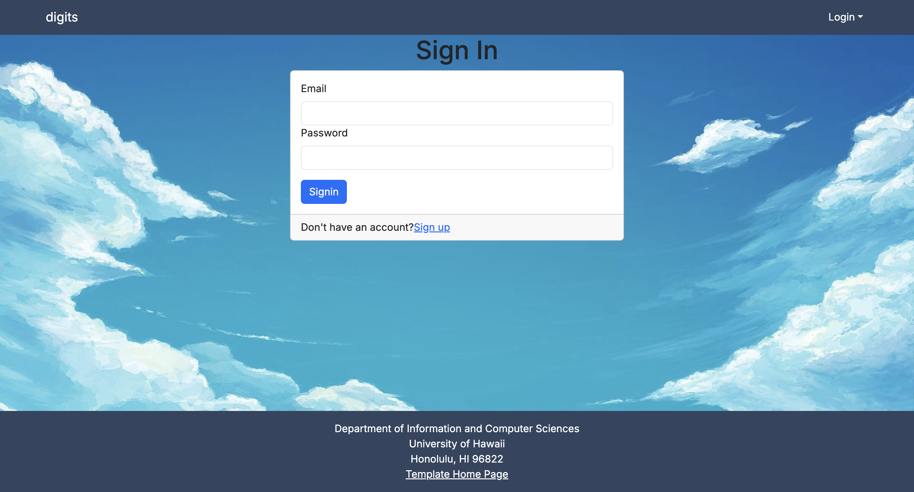
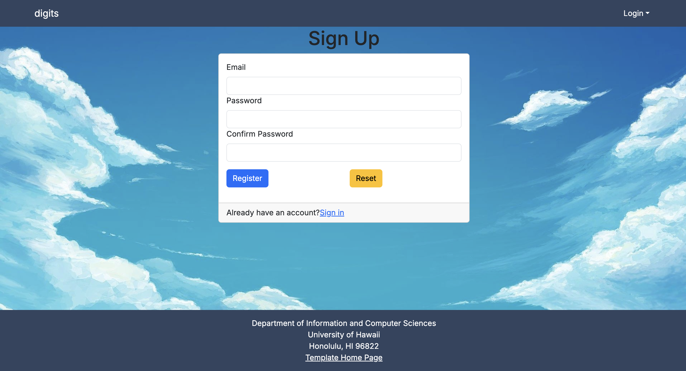
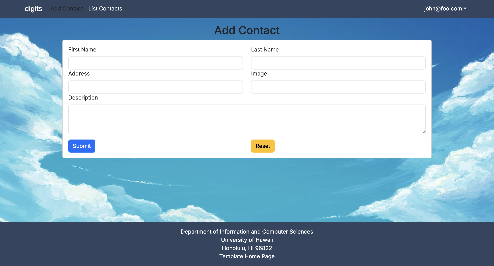
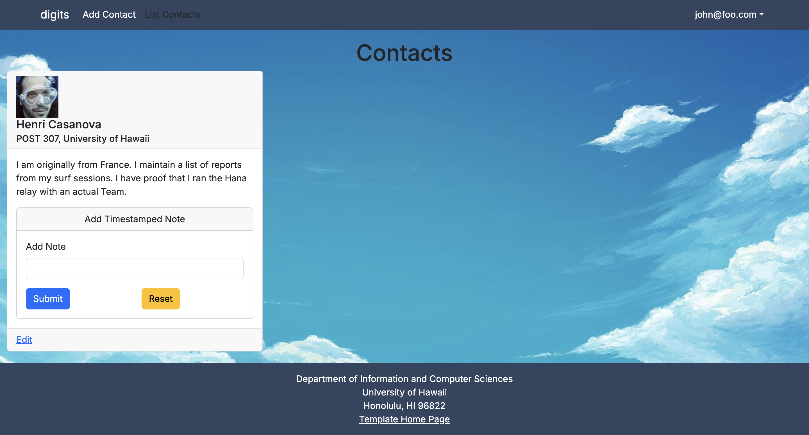
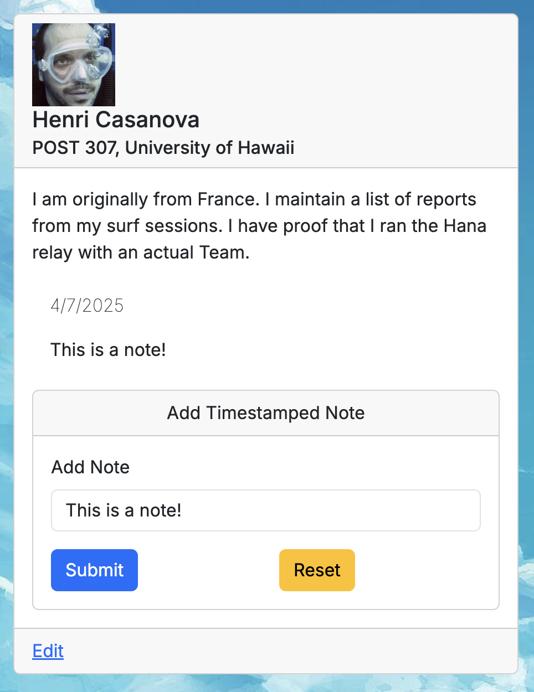
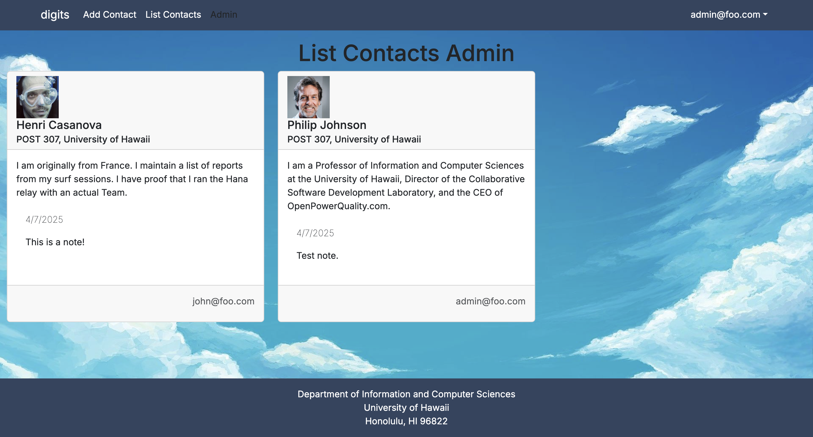

This _Digits_ project allows for the following:

- Account Setup
- Contact Creation/Management
- Adding Notes

Examples of the these capabilities will be provided.

# User Interface
## Landing Page
First loading the landing page will inform the user of the multiple functionalities of the application:

## Account Creation
When not logged in, clicking the top-right corner of the page will prompt users to log in or sign up:

 

## Contact Creation
With an account, users can now click on the 'Add Contacts' page within the navigation bar to bring them to this page:

Information for a contact, including a link to their picture can be added.

## Contact Management
Added contacts will be displayed when a user navigates to the 'List Contacts' page:

Clicking on the 'Edit' link allows users to change their contact's information via a form similar to the one used to add a contact.

## Adding Notes
To add notes, users simply add text to the text field within their contact. This is what a timestamped note will look like:

## Admin Page

Administrators of the page are allowed to view all contacts and their owners:

